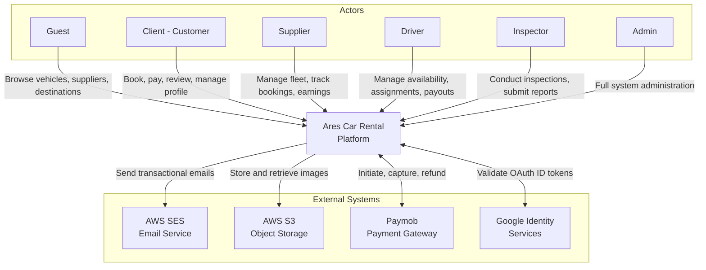
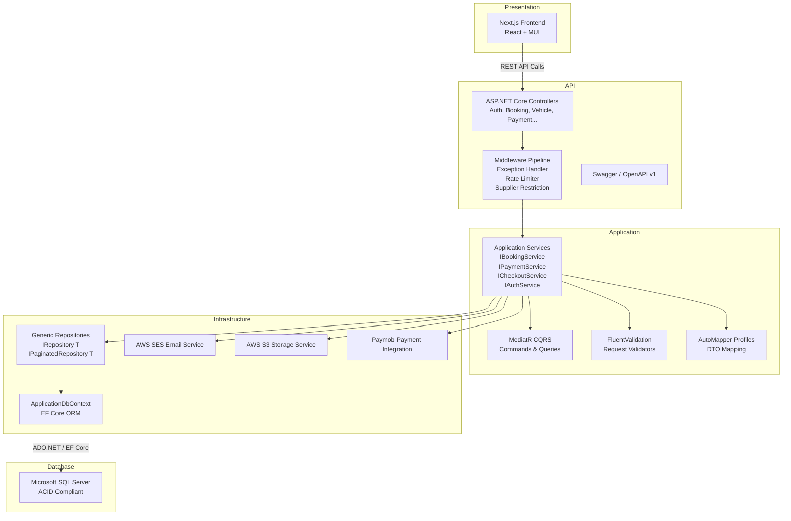
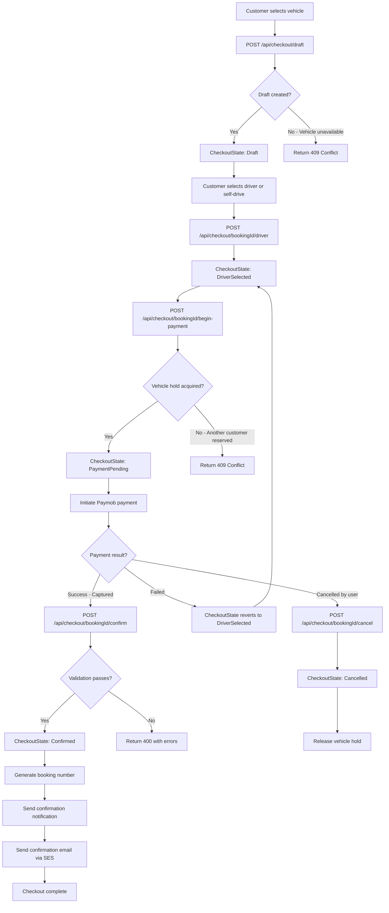
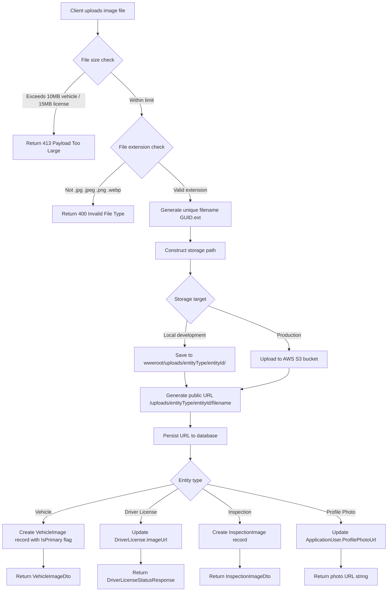
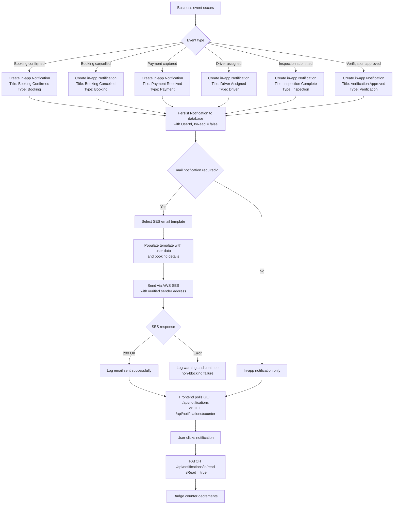
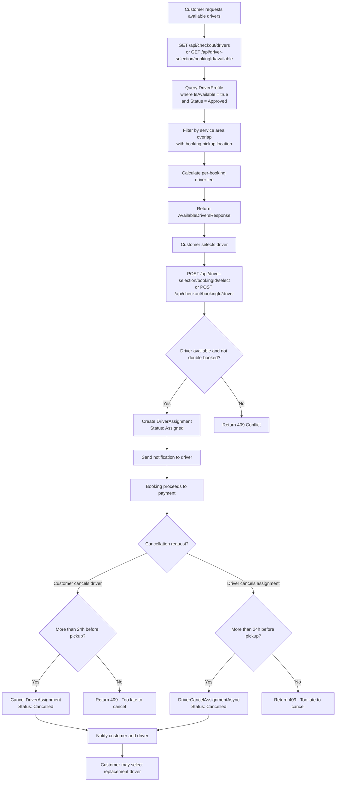

# CHAPTER 3: SYSTEM DESIGN & ARCHITECTURE

## 3.1 Introduction

This chapter presents the comprehensive system design and architectural blueprint for the Ares Car Rental platform, a graduation project developed for the Systems & Computers Engineering Department at Al-Azhar University. The primary purpose of this chapter is to establish architectural rigor by formally documenting the structural decisions, technology mappings, data models, and algorithmic workflows that govern the system's behavior.

A well-defined architecture ensures that functional and non-functional requirements—scalability, security, maintainability, and reliability—are met through deliberate, traceable design choices rather than ad-hoc implementation. This chapter progresses from a high-level system context (identifying external actors and dependencies) down through the layered component architecture, into the detailed database schema and RESTful API contract, and concludes with the key algorithms and user interface paradigms that realize the system's core business logic. Every architectural decision is justified against the project's constraints, and all structural models conform to established UML and industry-standard diagramming practices.

## 3.2 System Context

The Ares Car Rental platform operates within a distributed ecosystem, interacting with various human actors and external software services. Understanding the system context is critical for defining trust boundaries, security perimeters, and integration contracts. The system context diagram below illustrates the primary actors and the external systems they interact with, following the C4 Model's Level 1 (System Context) abstraction.

### Actors

1. **Guest**: An unauthenticated visitor browsing the public landing page, searching for vehicles, viewing supplier profiles, and exploring destinations. The Guest has no access to protected endpoints.
2. **Client (Customer)**: An authenticated user who can create bookings, process payments, submit reviews, manage their profile, upload verification documents, and select drivers. The Client interacts with the system primarily through the Next.js frontend.
3. **Supplier**: An authenticated vehicle fleet owner who manages their vehicle inventory, tracks bookings, monitors earnings, and responds to customer reviews. Suppliers are restricted from modifying data outside their ownership scope via the `RestrictedSupplierActionFilter`.
4. **Driver**: An authenticated user who completes their profile, submits driver license documentation, toggles availability, views assigned bookings, and tracks earnings/payouts.
5. **Inspector**: An authenticated user responsible for conducting pre- and post-rental vehicle inspections, uploading condition images, and submitting approval/rejection reports.
6. **Admin**: A privileged user with full system access, including user management, booking oversight, commission configuration, driver verification, and system-wide analytics.

### External Systems

1. **AWS SES (Simple Email Service)**: Handles transactional email delivery for email verification, password reset, booking confirmations, and notification dispatch.
2. **AWS S3 (Simple Storage Service)**: Provides durable object storage for user profile photos, vehicle images, driver license scans, and inspection report images.
3. **Paymob Payment Gateway**: Processes financial transactions including payment initiation, capture, callback handling, webhook processing, and refund operations. Paymob is the primary payment processor for the Egyptian market.
4. **Google Identity Services**: Provides OAuth 2.0 ID token validation for social sign-in, allowing users to authenticate via their Google account.



*Figure 3.2: System Context showing interaction with external services and actors.*

The trust boundary lies at the API Gateway layer where JWT authentication is enforced. External systems communicate via secure HTTPS endpoints, and all file uploads are validated for type and size before persistence to S3. Paymob callbacks are verified against expected HMAC signatures to prevent spoofing.

## 3.3 Component / Layered Architecture

The Ares platform adopts a strict Layered Architecture (N-Tier) pattern, enforcing separation of concerns across four principal layers: Presentation, Application, Domain/Infrastructure, and Database. This monolithic layered approach was deliberately chosen over a microservices architecture (see ADR in Section 3.7) to match the team size and project scope while preserving clean boundaries that would facilitate future decomposition if required.

### Layer Descriptions

**Presentation Layer (Frontend)**: Built with Next.js (React), this layer handles server-side rendering (SSR) for SEO-critical public pages, client-side rendering (CSR) for interactive dashboards, and static generation where applicable. The frontend communicates exclusively with the backend via the RESTful API. State management leverages React Context for global concerns (authentication, theme) and local component state for isolated UI concerns. The `AuthProvider` wraps the application with `next-auth`'s `SessionProvider` and a custom `JwtErrorBoundary` to gracefully handle expired or malformed tokens.

**API Layer (Backend - Presentation)**: The .NET Core Web API layer exposes RESTful endpoints via ASP.NET Core controllers. This layer is responsible for HTTP request/response handling, input validation via FluentValidation, JWT claims extraction, and role-based authorization via `[Authorize]` attributes. Middleware components—`GlobalExceptionHandlerMiddleware`, `RateLimitingMiddleware`, and `RestrictedSupplierActionFilter`—handle cross-cutting concerns at this layer.

**Application Layer (Backend - Business Logic)**: Contains service interfaces (`IBookingService`, `IPaymentService`, `ICheckoutService`, etc.), DTOs, validation logic, AutoMapper profiles, and MediatR command/query handlers. This layer orchestrates business workflows (e.g., the staged checkout flow) and enforces business rules without direct database dependency.

**Infrastructure Layer (Backend - Data Access)**: Implements repository patterns (`IRepository<T>`, `IPaginatedRepository<T>`), the Entity Framework Core `ApplicationDbContext`, and concrete service implementations. This layer manages SQL Server connections, migrations, and raw SQL queries where optimization is required.

**Database Layer**: SQL Server provides ACID-compliant persistent storage, critical for financial transaction integrity. Entity Framework Core serves as the ORM, with code-first migrations managing schema evolution.



*Figure 3.3.a: Layered architecture showing technology stack mapping.*

### Technology Mapping Table

| Layer | Technology | Version | Purpose |
|-------|-----------|---------|---------|
| Frontend | Next.js (React) | 14+ | SSR/CSR hybrid rendering, SEO optimization |
| Frontend UI | Material UI (MUI) | 5+ | Component library with RTL/i18n support |
| Frontend State | next-auth / React Context | — | Authentication state, theme management |
| API | ASP.NET Core Web API | 8+ | RESTful endpoint hosting |
| API Docs | Swashbuckle (Swagger) | 6+ | OpenAPI specification generation |
| Application | MediatR | 12+ | CQRS pattern (commands/queries) |
| Application | FluentValidation | 11+ | Request DTO validation |
| Application | AutoMapper | 12+ | Entity-to-DTO mapping |
| Infrastructure | Entity Framework Core | 8+ | ORM with SQL Server provider |
| Infrastructure | ASP.NET Identity | 8+ | User management, role-based access |
| Database | Microsoft SQL Server | 2019+ | ACID-compliant relational storage |
| CI/CD | GitHub Actions | — | Automated build, test, deploy pipeline |
| Package Mgmt | Bun (Frontend) / NuGet (Backend) | — | Dependency management |

## 3.4 Database Schema

The database schema is designed following third normal form (3NF) principles with strategic denormalization where read performance justifies it (e.g., `TotalPrice` on `Booking`). All primary keys use `uniqueidentifier` (GUID) to support distributed scenarios and prevent enumeration attacks. Foreign key constraints enforce referential integrity, and cascading deletes are restricted on critical entities to preserve audit trails.

### Entity-Relationship Diagram

```mermaid
erDiagram
    ApplicationUser ||--o{ Vehicle : "owns"
    ApplicationUser ||--o{ Booking : "creates"
    ApplicationUser ||--o{ Review : "writes"
    ApplicationUser ||--o{ UserAddress : "has"
    ApplicationUser ||--o{ Notification : "receives"
    ApplicationUser ||--o{ RefreshToken : "has"
    ApplicationUser ||--o{ UserVerification : "submits"
    ApplicationUser ||--o{ DriverProfile : "is"
    ApplicationUser ||--o{ Favorite : "saves"
    ApplicationUser ||--o{ PaymentMethod : "stores"
    ApplicationUser ||--o{ DriverLicense : "holds"

    Vehicle ||--o{ Booking : "booked in"
    Vehicle ||--o{ VehicleImage : "has"
    Vehicle ||--o{ Review : "receives"
    Vehicle }o--|| Category : "belongs to"
    Vehicle }o--|| ServiceArea : "located in"

    Booking ||--|| Payment : "paid via"
    Booking ||--o| DriverAssignment : "assigned"
    Booking ||--o| Inspection : "inspected"
    Booking ||--o{ Promotion : "applies"

    DriverProfile ||--o{ DriverAssignment : "accepts"
    DriverProfile ||--o{ DriverReview : "receives"
    DriverProfile ||--o{ DriverPayout : "requests"
    DriverProfile ||--o{ DriverEarning : "earns"

    Inspector ||--o{ Inspection : "conducts"

    Category ||--o{ CategoryOffer : "has"
    Category ||--o{ Promotion : "has"

    ApplicationUser {
        uniqueidentifier Id PK
        nvarchar256 FirstName
        nvarchar256 LastName
        nvarchar256 Email
        nvarchar256 NormalizedEmail
        nvarchar500 PasswordHash
        nvarchar50 PhoneNumber
        nvarchar50 Status
        nvarchar500 ProfilePhotoUrl
        bit EmailVerified
        bit AcceptedTerms
        bit AcceptedPrivacy
        datetime2 CreatedAt
        datetime2 UpdatedAt
    }

    Vehicle {
        uniqueidentifier Id PK
        uniqueidentifier UserId FK
        uniqueidentifier CategoryId FK
        uniqueidentifier ServiceAreaId FK
        nvarchar100 Make
        nvarchar100 Model
        int Year
        nvarchar20 LicensePlate
        nvarchar50 Transmission
        nvarchar50 FuelType
        int Seats
        decimal DailyPrice
        decimal WeeklyPrice
        decimal MonthlyPrice
        nvarchar50 Status
        nvarchar50 AvailabilityStatus
        bit IsActive
        nvarchar200 LocationCity
        datetime2 CreatedAt
    }

    Category {
        uniqueidentifier Id PK
        nvarchar100 Name
        nvarchar500 Description
        nvarchar200 ImageUrl
        datetime2 CreatedAt
    }

    CategoryOffer {
        uniqueidentifier Id PK
        uniqueidentifier CategoryId FK
        decimal DiscountPercentage
        bit IsActive
        datetime2 StartDate
        datetime2 EndDate
        datetime2 CreatedAt
    }

    Booking {
        uniqueidentifier Id PK
        nvarchar20 BookingNumber
        uniqueidentifier UserId FK
        uniqueidentifier VehicleId FK
        uniqueidentifier PickupLocationId FK
        uniqueidentifier ReturnLocationId FK
        datetime2 PickupDate
        datetime2 ReturnDate
        int TotalDays
        decimal DailyRate
        decimal TotalPrice
        decimal InsuranceAmount
        decimal DriverFee
        nvarchar50 Status
        nvarchar50 CheckoutState
        nvarchar500 CancellationReason
        datetime2 CreatedAt
        datetime2 UpdatedAt
    }

    Payment {
        uniqueidentifier Id PK
        uniqueidentifier BookingId FK
        nvarchar100 TransactionId
        decimal Amount
        nvarchar50 Status
        nvarchar50 Method
        nvarchar100 PaymobOrderId
        datetime2 ProcessedAt
        datetime2 CreatedAt
    }

    UserAddress {
        uniqueidentifier Id PK
        uniqueidentifier UserId FK
        nvarchar200 Street
        nvarchar100 City
        nvarchar100 Governorate
        nvarchar100 Country
        nvarchar20 PostalCode
        bit IsDefault
        datetime2 CreatedAt
    }

    Review {
        uniqueidentifier Id PK
        uniqueidentifier VehicleId FK
        uniqueidentifier UserId FK
        uniqueidentifier BookingId FK
        int Rating
        nvarchar1000 Comment
        nvarchar500 SupplierReply
        datetime2 SupplierReplyDate
        bit IsReported
        nvarchar500 ReportReason
        datetime2 CreatedAt
        datetime2 UpdatedAt
    }

    DriverProfile {
        uniqueidentifier Id PK
        uniqueidentifier UserId FK
        nvarchar100 NationalId
        nvarchar200 LicenseNumber
        nvarchar50 Status
        bit IsAvailable
        decimal Rating
        int TotalTrips
        decimal TotalEarnings
        decimal AvailableBalance
        nvarchar100 WalletNumber
        nvarchar50 WalletProvider
        datetime2 CreatedAt
    }

    DriverAssignment {
        uniqueidentifier Id PK
        uniqueidentifier BookingId FK
        uniqueidentifier DriverProfileId FK
        nvarchar50 Status
        decimal Fee
        datetime2 AssignedAt
        datetime2 UpdatedAt
    }

    DriverLicense {
        uniqueidentifier Id PK
        uniqueidentifier UserId FK
        nvarchar500 ImageUrl
        nvarchar50 VerificationStatus
        nvarchar500 RejectionReason
        datetime2 ExpiryDate
        datetime2 SubmittedAt
        datetime2 ReviewedAt
    }

    DriverReview {
        uniqueidentifier Id PK
        uniqueidentifier DriverProfileId FK
        uniqueidentifier BookingId FK
        uniqueidentifier UserId FK
        int Rating
        nvarchar1000 Comment
        datetime2 CreatedAt
    }

    DriverPayout {
        uniqueidentifier Id PK
        uniqueidentifier DriverProfileId FK
        decimal Amount
        nvarchar50 Status
        nvarchar500 RejectionReason
        datetime2 RequestedAt
        datetime2 ProcessedAt
    }

    DriverEarning {
        uniqueidentifier Id PK
        uniqueidentifier DriverProfileId FK
        uniqueidentifier BookingId FK
        decimal Amount
        decimal CommissionRate
        decimal NetAmount
        datetime2 EarnedAt
    }

    Inspection {
        uniqueidentifier Id PK
        uniqueidentifier BookingId FK
        uniqueidentifier InspectorId FK
        nvarchar50 Status
        int Odometer
        nvarchar20 FuelLevel
        nvarchar50 Condition
        nvarchar1000 Notes
        bit IsApproved
        datetime2 InspectedAt
        datetime2 CreatedAt
    }

    InspectionImage {
        uniqueidentifier Id PK
        uniqueidentifier InspectionId FK
        nvarchar500 ImageUrl
        nvarchar100 Caption
        datetime2 UploadedAt
    }

    VehicleImage {
        uniqueidentifier Id PK
        uniqueidentifier VehicleId FK
        nvarchar500 ImageUrl
        bit IsPrimary
        int DisplayOrder
        datetime2 UploadedAt
    }

    Notification {
        uniqueidentifier Id PK
        uniqueidentifier UserId FK
        nvarchar200 Title
        nvarchar1000 Message
        nvarchar50 Type
        bit IsRead
        datetime2 CreatedAt
    }

    RefreshToken {
        uniqueidentifier Id PK
        uniqueidentifier UserId FK
        nvarchar500 Token
        nvarchar50 ReplacedByToken
        bit IsRevoked
        datetime2 ExpiresAt
        datetime2 CreatedAt
    }

    UserVerification {
        uniqueidentifier Id PK
        uniqueidentifier UserId FK
        nvarchar500 DocumentUrl
        nvarchar50 Status
        nvarchar500 RejectionReason
        datetime2 SubmittedAt
        datetime2 ReviewedAt
    }

    Favorite {
        uniqueidentifier Id PK
        uniqueidentifier UserId FK
        uniqueidentifier VehicleId FK
        datetime2 CreatedAt
    }

    PaymentMethod {
        uniqueidentifier Id PK
        uniqueidentifier UserId FK
        nvarchar100 Provider
        nvarchar50 Last4Digits
        nvarchar20 ExpiryMonth
        nvarchar20 ExpiryYear
        bit IsDefault
        datetime2 CreatedAt
    }

    Promotion {
        uniqueidentifier Id PK
        uniqueidentifier CategoryId FK
        nvarchar200 Code
        decimal DiscountPercentage
        bit IsActive
        datetime2 StartDate
        datetime2 EndDate
        datetime2 CreatedAt
    }

    ServiceArea {
        uniqueidentifier Id PK
        nvarchar100 Name
        bit IsActive
        datetime2 CreatedAt
    }

    SystemSetting {
        uniqueidentifier Id PK
        nvarchar100 Key
        nvarchar500 Value
        datetime2 UpdatedAt
    }

    Inspector {
        uniqueidentifier Id PK
        uniqueidentifier UserId FK
        bit IsActive
        int CompletedInspections
        datetime2 CreatedAt
    }

    Location {
        uniqueidentifier Id PK
        nvarchar200 Name
        nvarchar100 City
        nvarchar100 Governorate
        nvarchar100 Country
        bit IsActive
        datetime2 CreatedAt
    }
```



*Figure 3.4: Entity-Relationship Diagram showing all entities and relationships.*

### Entity Descriptions

**ApplicationUser**: The central identity entity extending ASP.NET Identity's `IdentityUser`. Stores core profile data including name, email, phone, status (Active/Blocked/Pending), and profile photo URL. The `Status` field enables admin-enforced account suspension. Email verification and consent flags (`AcceptedTerms`, `AcceptedPrivacy`) are tracked at this level. Sample data: `Id: 123e4567-e89b-12d3-a456-426614174000, FirstName: "Ahmed", LastName: "Hassan", Email: "ahmed@example.com", Status: "Active", EmailVerified: true`.

**Vehicle**: Represents a rentable car owned by a Supplier (via `UserId`). Contains make, model, year, transmission type, fuel type, seat count, and tiered pricing (daily/weekly/monthly). `Status` is admin-managed (Pending/Approved/Rejected), while `AvailabilityStatus` is supplier-controlled (Available/Unavailable). `LocationCity` enables geographic search filtering. Sample data: `Make: "Toyota", Model: "Corolla 2023", DailyPrice: 450.00, Status: "Approved", AvailabilityStatus: "Available"`.

**Booking**: The core transactional entity. Each booking references a customer, vehicle, pickup/return locations, and dates. `TotalPrice` is denormalized for reporting efficiency. `CheckoutState` tracks the staged checkout lifecycle (Draft → DriverSelected → PaymentPending → Confirmed). `BookingNumber` provides a human-readable reference. Sample data: `BookingNumber: "ARE-2024-001234", Status: "Confirmed", TotalPrice: 1350.00, TotalDays: 3`.

**Payment**: Linked 1:1 to a Booking. Tracks the Paymob transaction lifecycle with `Status` values (Pending/Authorized/Captured/Failed/Refunded). `PaymobOrderId` enables reconciliation with the gateway. Sample data: `TransactionId: "TXN-8f14e45f", Amount: 1350.00, Status: "Captured", Method: "Card"`.

**DriverProfile**: Extends a user into a driver role. Tracks availability, rating, trip count, earnings balance, and wallet information for payouts. `Status` follows the admin verification workflow (Pending/Approved/Rejected/Suspended). Sample data: `NationalId: "29901011234567", IsAvailable: true, Rating: 4.7, TotalTrips: 42, AvailableBalance: 3200.00`.

**DriverAssignment**: Junction entity linking a Booking to a DriverProfile with a specific fee. `Status` tracks the assignment lifecycle (Assigned/Cancelled/Completed). The 24-hour cancellation rule is enforced at the application layer. Sample data: `Fee: 150.00, Status: "Assigned", AssignedAt: 2024-06-15T10:00:00Z`.

**Inspection**: Records pre/post-rental vehicle condition assessments. Linked to a Booking and an Inspector. Contains odometer reading, fuel level, overall condition, and approval status. Once submitted, the inspection is locked (immutable). Sample data: `Odometer: 45230, FuelLevel: "Full", Condition: "Good", IsApproved: true`.

**Review**: Customer-authored vehicle reviews with a 1-5 rating. Supports supplier replies and a reporting mechanism for inappropriate content. The 24-hour edit window is enforced at the service layer. Sample data: `Rating: 4, Comment: "Clean car, smooth pickup"`, SupplierReply: "Thank you for your feedback!"`.

**Notification**: In-app notifications scoped to a user. Supports read/unread state and type-based categorization. Sample data: `Title: "Booking Confirmed", Message: "Your booking ARE-2024-001234 is confirmed", Type: "Booking", IsRead: false`.

**RefreshToken**: Implements secure JWT token rotation. Each refresh token is tracked with revocation status and replacement chain to prevent replay attacks. Sample data: `Token: "base64-encoded-value", IsRevoked: false, ExpiresAt: 2024-07-15T10:00:00Z`.

**SystemSetting**: Key-value configuration store for platform-wide settings like `GlobalCommissionPercentage` and `driver.commission_percentage`. Avoids hardcoding business parameters. Sample data: `Key: "GlobalCommissionPercentage", Value: "10.0"`.

## 3.5 API Documentation

The Ares platform exposes a comprehensive RESTful API following OpenAPI 3.0 specification conventions. All endpoints are prefixed with `/api` and return JSON payloads. Authentication is via JWT Bearer tokens in the `Authorization` header. Rate limiting is applied to sensitive endpoints (5 login attempts per 15 minutes; 5 registration attempts per hour).

### Endpoint Catalog

| # | Method | Endpoint | Description | Payload Format | Response Format | Status Codes |
|---|--------|----------|-------------|----------------|-----------------|--------------|
| 1 | POST | /api/auth/register | Register new user | RegisterRequest | AuthResponse | 201, 400, 409, 429 |
| 2 | POST | /api/auth/login | Authenticate user | LoginRequest | LoginResponse | 200, 401, 403, 429 |
| 3 | POST | /api/auth/forgot-password | Request password reset | ForgotPasswordRequest | 200 | 200, 400 |
| 4 | POST | /api/auth/reset-password | Reset password with token | ResetPasswordRequest | 200 | 200, 400 |
| 5 | GET | /api/auth/verify-email | Verify email address | userId, token (query) | 200 | 200, 400 |
| 6 | POST | /api/auth/refresh-token | Refresh access token | RefreshTokenRequest | LoginResponse | 200, 401 |
| 7 | POST | /api/auth/revoke-token | Revoke refresh token | RevokeTokenRequest | 200 | 200, 401, 404 |
| 8 | POST | /api/auth/google-signin | Google OAuth sign-in | GoogleSignInRequest | LoginResponse | 200, 400, 401, 403 |
| 9 | GET | /api/auth/demo-roles | Get available demo roles | — | List of strings | 200 |
| 10 | POST | /api/auth/demo-login | Demo account login | DemoLoginRequest | LoginResponse | 200, 400 |
| 11 | GET | /api/vehicles/search | Search available vehicles | Query params | PagedResult of VehicleListDto | 200, 400 |
| 12 | GET | /api/vehicles/{vehicleId} | Get vehicle details | — | VehicleDetailsDto | 200, 404 |
| 13 | GET | /api/vehicles/{vehicleId}/availability | Get availability calendar | Query params | VehicleAvailabilityDto | 200, 400 |
| 14 | GET | /api/vehicles/{vehicleId}/pricing | Calculate pricing | Query params | VehiclePricingDto | 200, 400 |
| 15 | GET | /api/vehicles/{vehicleId}/images | Get vehicle images | — | List of VehicleImageDto | 200 |
| 16 | GET | /api/vehicles/{vehicleId}/reviews | Get vehicle reviews | Query params | PagedResult of ReviewDto | 200 |
| 17 | POST | /api/vehicles/{vehicleId}/favorite | Add to favorites | — | 200 | 200, 401 |
| 18 | POST | /api/vehicles | Create vehicle (Admin/Supplier) | CreateVehicleRequest | VehicleResponse | 201, 400, 401, 403 |
| 19 | PUT | /api/vehicles/{id} | Update vehicle | UpdateVehicleRequest | VehicleResponse | 200, 400, 403, 404 |
| 20 | DELETE | /api/vehicles/{id} | Delete vehicle | — | VehicleResponse | 200, 403, 404 |
| 21 | POST | /api/vehicles/{id}/images | Upload vehicle image | multipart/form-data | VehicleImageDto | 200, 400, 413 |
| 22 | GET | /api/bookings | Get user bookings | Query params | PagedResult of BookingListDto | 200, 401 |
| 23 | GET | /api/bookings/{id} | Get booking details | — | BookingDetailsDto | 200, 401, 404 |
| 24 | POST | /api/bookings/create | Create booking | CreateBookingRequest | BookingResponse | 201, 400, 401 |
| 25 | DELETE | /api/bookings/{id}/cancel | Cancel booking | — | 200 | 200, 401, 404, 409 |
| 26 | GET | /api/bookings/{id}/cancel-preview | Get refund preview | — | RefundResult | 200, 401 |
| 27 | POST | /api/checkout/draft | Create checkout draft | CreateDraftRequest | CheckoutStateDto | 200, 400, 401 |
| 28 | POST | /api/checkout/{bookingId}/driver | Select driver | SelectDriverRequest | CheckoutStateDto | 200, 400, 401 |
| 29 | POST | /api/checkout/{bookingId}/begin-payment | Begin payment | — | CheckoutStateDto | 200, 401, 409 |
| 30 | POST | /api/checkout/{bookingId}/confirm | Confirm checkout | ConfirmRequest | BookingResponse | 200, 400, 401, 409 |
| 31 | POST | /api/checkout/{bookingId}/cancel | Cancel checkout | — | CheckoutStateDto | 200, 401 |
| 32 | GET | /api/checkout/active | Get active checkout | — | CheckoutStateDto | 200, 204 |
| 33 | GET | /api/checkout/eligibility | Check self-drive eligibility | — | DriveEligibilityDto | 200, 401 |
| 34 | GET | /api/checkout/drivers | Get available drivers | Query params | AvailableDriversResponse | 200, 401 |
| 35 | POST | /api/payments/create | Create payment | PaymentRequest | PaymentResponse | 200, 400, 401 |
| 36 | POST | /api/payments/paymob/initiate | Initiate Paymob payment | InitiatePaymentRequest | PaymobInitiateResponse | 200, 400 |
| 37 | GET | /api/payments/paymob/callback | Paymob redirect callback | Query params | 200/Redirect | 200 |
| 38 | POST | /api/payments/paymob/webhook | Paymob webhook | JSON body | 200 | 200 |
| 39 | GET | /api/payments/history | Get payment history | Query params | PagedResult of PaymentDto | 200, 401 |
| 40 | GET | /api/payments/{transactionId} | Get payment details | — | PaymentDto | 200, 401, 404 |
| 41 | GET | /api/payments/{transactionId}/receipt | Download receipt | format (query) | File (PDF/HTML) | 200, 401, 404 |
| 42 | GET | /api/payments/pending | Get pending payments | — | List of PaymentDto | 200, 401 |
| 43 | GET | /api/payments/failed | Get failed payments | limit (query) | List of PaymentDto | 200, 401 |
| 44 | POST | /api/payments/{bookingId}/refund | Admin refund | AdminRefundRequest | RefundResponse | 200, 401, 403 |
| 45 | POST | /api/reviews | Create review | CreateReviewRequest | ReviewResponse | 201, 400, 401 |
| 46 | GET | /api/reviews/booking/{bookingId} | Get review by booking | — | ReviewDto / 204 | 200, 204, 401 |
| 47 | PUT | /api/reviews/{reviewId} | Update review | UpdateReviewRequest | ReviewDto | 200, 400, 401 |
| 48 | POST | /api/driver-reviews | Create driver review | CreateDriverReviewRequest | DriverReviewDto | 201, 400, 401 |
| 49 | GET | /api/driver-reviews/{driverProfileId} | Get driver reviews | — | List of DriverReviewDto | 200 |
| 50 | GET | /api/notifications | Get user notifications | Query params | List of NotificationDto | 200, 401 |
| 51 | PATCH | /api/notifications/{id}/read | Mark notification as read | — | 200 | 200, 401 |
| 52 | PATCH | /api/notifications/read-all | Mark all as read | — | 200 | 200, 401 |
| 53 | GET | /api/notifications/counter | Get unread count | userId (query) | Count | 200, 401, 403 |
| 54 | DELETE | /api/notifications/{id} | Delete notification | — | 200, 404 | 200, 401, 404 |
| 55 | GET | /api/users/{userId}/profile | Get user profile | — | UserProfileDto | 200, 401, 403 |
| 56 | PUT | /api/users/{userId}/profile | Update profile | UpdateProfileRequest | UpdateProfileResponse | 200, 400, 401 |
| 57 | POST | /api/users/{userId}/photo | Upload profile photo | multipart/form-data | URL string | 200, 401 |
| 58 | POST | /api/users/{userId}/change-password | Change password | ChangePasswordRequest | 200 | 200, 400, 401 |
| 59 | GET | /api/admin/users | List users (Admin) | Query params | PagedResult of UserManagementDto | 200, 401, 403 |
| 60 | POST | /api/admin/users | Create user (Admin) | CreateUserRequest | UserManagementResponse | 201, 400, 403 |
| 61 | PUT | /api/admin/users/{id} | Update user (Admin) | UpdateUserRequest | UserManagementResponse | 200, 400, 403 |
| 62 | DELETE | /api/admin/users/{id} | Delete user (Admin) | — | DeleteUserResponse | 200, 403, 404, 409 |
| 63 | PATCH | /api/admin/users/{id}/toggle-status | Toggle user status | — | Status result | 200, 403 |
| 64 | GET | /api/admin/drivers | List drivers (Admin) | status (query) | List of DriverDto | 200, 403 |
| 65 | POST | /api/admin/drivers/{id}/approve | Approve driver | — | 200 | 200, 403, 404 |
| 66 | POST | /api/admin/drivers/{id}/reject | Reject driver | RejectRequest | 200 | 200, 400, 403 |
| 67 | POST | /api/admin/drivers/{id}/enable | Enable driver | — | 200 | 200, 403 |
| 68 | POST | /api/admin/drivers/{id}/disable | Disable driver | — | 200 | 200, 403 |
| 69 | GET | /api/admin/verifications | List verifications | page, status (query) | PagedResult of AdminVerificationDto | 200, 403 |
| 70 | POST | /api/admin/verifications/{id}/approve | Approve verification | — | AdminVerificationDto | 200, 403 |
| 71 | POST | /api/admin/verifications/{id}/reject | Reject verification | RejectRequest | AdminVerificationDto | 200, 400, 403 |
| 72 | GET | /api/admin/driver-licenses | List driver licenses | page, status (query) | PagedResult of AdminDriverLicenseDto | 200, 403 |
| 73 | POST | /api/admin/driver-licenses/{id}/approve | Approve license | — | AdminDriverLicenseDto | 200, 403 |
| 74 | POST | /api/admin/driver-licenses/{id}/reject | Reject license | RejectRequest | AdminDriverLicenseDto | 200, 400, 403 |
| 75 | GET | /api/admin/bookings | List bookings (Admin) | Query params | PagedResult of BookingListDto | 200, 403 |
| 76 | GET | /api/admin/bookings/stats | Booking statistics | — | AdminBookingStatsDto | 200, 403 |
| 77 | GET | /api/admin/bookings/analytics | Booking analytics | — | AdminBookingAnalyticsDto | 200, 403 |
| 78 | PATCH | /api/admin/bookings/{id}/status | Update booking status | StatusRequest | 200 | 200, 400, 403 |
| 79 | PUT | /api/admin/bookings/{id}/edit | Edit booking | EditBookingRequest | BookingDetailsDto | 200, 400, 403 |
| 80 | POST | /api/admin/bookings/bulk-delete | Bulk delete bookings | IdsRequest | 200 | 200, 403 |
| 81 | GET | /api/admin/bookings/customers | Search customers | search (query) | List of CustomerPickerItemDto | 200, 403 |
| 82 | GET | /api/admin/bookings/vehicles | Search available vehicles | Query params | List of VehiclePickerItemDto | 200, 403 |
| 83 | GET | /api/admin/commission | Get global commission | — | Percentage | 200, 403 |
| 84 | PUT | /api/admin/commission | Update global commission | UpdateGlobalCommissionRequest | 200 | 200, 400, 403 |
| 85 | GET | /api/admin/driver-commission | Get driver commission | — | Percentage | 200, 403 |
| 86 | PUT | /api/admin/driver-commission | Update driver commission | UpdateDriverCommissionRequest | 200 | 200, 400, 403 |
| 87 | GET | /api/admin/driver-earnings/overview | Driver earnings overview | driverProfileId (query) | AdminDriverEarningsOverviewDto | 200, 403 |
| 88 | GET | /api/admin/driver-earnings/pending-payouts | Pending payouts | — | List of PayoutDto | 200, 403 |
| 89 | POST | /api/admin/driver-earnings/payouts/{payoutId}/approve | Approve payout | — | 200 | 200, 403 |
| 90 | POST | /api/admin/driver-earnings/payouts/{payoutId}/reject | Reject payout | RejectRequest | 200 | 200, 400, 403 |
| 91 | GET | /api/admin/inspectors | List inspectors | activeOnly (query) | List of InspectorDto | 200, 403 |
| 92 | POST | /api/admin/inspectors | Create inspector | CreateInspectorRequest | InspectorDto | 201, 400, 403 |
| 93 | PATCH | /api/admin/inspectors/{id}/status | Update inspector status | UpdateStatusRequest | InspectorDto | 200, 403 |
| 94 | GET | /api/admin/booking-inspections | List inspections | — | List of InspectionDto | 200, 403 |
| 95 | POST | /api/admin/booking-inspections/assign | Assign inspector | AssignInspectorRequest | InspectionDetailsDto | 200, 400, 403 |
| 96 | GET | /api/admin/suppliers | List suppliers (Admin) | page, size (query) | PagedResult of SupplierManagementDto | 200, 403 |
| 97 | POST | /api/admin/suppliers | Create supplier | CreateSupplierRequest | SupplierManagementResponse | 201, 400, 403 |
| 98 | PUT | /api/admin/suppliers/{id} | Update supplier | UpdateSupplierRequest | SupplierManagementResponse | 200, 400, 403 |
| 99 | DELETE | /api/admin/suppliers/{id} | Delete supplier | — | SupplierManagementResponse | 200, 403 |
| 100 | GET | /api/supplier/vehicles | List supplier vehicles | Query params | PagedResult of SupplierVehicleListItemDto | 200, 401 |
| 101 | POST | /api/supplier/vehicles | Create supplier vehicle | CreateSupplierVehicleRequest | VehicleResponse | 201, 400, 401 |
| 102 | PUT | /api/supplier/vehicles/{id} | Update supplier vehicle | UpdateSupplierVehicleRequest | VehicleResponse | 200, 400, 401 |
| 103 | DELETE | /api/supplier/vehicles/{id} | Delete supplier vehicle | — | VehicleResponse | 200, 401, 404 |
| 104 | PATCH | /api/supplier/vehicles/{id}/availability | Toggle availability | AvailabilityRequest | VehicleResponse | 200, 401, 409 |
| 105 | POST | /api/supplier/vehicles/{id}/images | Upload vehicle image | multipart/form-data | VehicleImageDto | 200, 401, 413 |
| 106 | GET | /api/supplier/bookings | List supplier bookings | Query params | PagedResult of SupplierBookingListItemDto | 200, 401 |
| 107 | GET | /api/supplier/bookings/{id} | Get supplier booking | — | SupplierBookingDetailsDto | 200, 401, 404 |
| 108 | GET | /api/supplier/earnings/stats | Earnings statistics | — | SupplierEarningsStatsDto | 200, 401 |
| 109 | GET | /api/supplier/earnings/chart | Monthly revenue chart | year (query) | List of MonthlyRevenuePointDto | 200, 401 |
| 110 | GET | /api/supplier/earnings/top-vehicles | Top earning vehicles | — | List of SupplierTopVehicleDto | 200, 401 |
| 111 | GET | /api/supplier/reviews | List supplier reviews | Query params | PagedResult of SupplierReviewListItemDto | 200, 401 |
| 112 | GET | /api/supplier/reviews/statistics | Review statistics | — | SupplierReviewStatisticsDto | 200, 401 |
| 113 | POST | /api/supplier/reviews/{reviewId}/reply | Save reply to review | SupplierReplyRequest | SupplierReviewListItemDto | 200, 400, 401 |
| 114 | POST | /api/supplier/reviews/{reviewId}/report | Report review | ReportRequest | SupplierReviewListItemDto | 200, 400, 401 |
| 115 | GET | /api/supplier/notifications | List supplier notifications | filter, page (query) | PagedResult of SupplierNotificationDto | 200, 401 |
| 116 | GET | /api/supplier/notifications/unread-count | Unread count | — | Count | 200, 401 |
| 117 | PATCH | /api/supplier/notifications/{id}/read | Mark as read | — | 200 | 200, 401 |
| 118 | PATCH | /api/supplier/notifications/read-all | Mark all as read | — | Updated count | 200, 401 |
| 119 | DELETE | /api/supplier/notifications/{id} | Delete notification | — | 200, 404 | 200, 401, 404 |
| 120 | GET | /api/supplier/dashboard/stats | Supplier dashboard stats | — | SupplierDashboardStatsDto | 200, 401 |
| 121 | GET | /api/supplier/dashboard/bookings-by-status | Bookings by status | — | BookingsByStatusDto | 200, 401 |
| 122 | GET | /api/driver/profile | Get driver profile | — | DriverProfileDto | 200, 401 |
| 123 | GET | /api/driver/profile/status | Get driver status | — | DriverStatusDto | 200, 401 |
| 124 | POST | /api/driver/profile/complete | Complete driver profile | multipart/form-data | DriverProfileDto | 200, 400, 401 |
| 125 | PATCH | /api/driver/profile/availability | Toggle availability | UpdateAvailabilityRequest | 200 | 200, 401 |
| 126 | GET | /api/driver/profile/payout-info | Get payout info | — | PayoutInfoDto | 200, 401 |
| 127 | PUT | /api/driver/profile/payout-info | Update payout info | UpdatePayoutInfoRequest | 200 | 200, 400, 401 |
| 128 | GET | /api/driver/assignments | Get driver assignments | — | List of AssignmentDto | 200, 401 |
| 129 | DELETE | /api/driver/assignments/{bookingId}/cancel | Cancel assignment | — | 200 | 200, 401, 409 |
| 130 | GET | /api/driver/dashboard/summary | Driver dashboard summary | — | DriverDashboardSummaryDto | 200, 401 |
| 131 | GET | /api/driver/earnings/stats | Earnings statistics | — | DriverEarningsStatsDto | 200, 401 |
| 132 | GET | /api/driver/earnings/chart | Monthly earnings chart | year (query) | List of MonthlyPointDto | 200, 401 |
| 133 | GET | /api/driver/earnings/top-bookings | Top earning bookings | — | List of DriverTopBookingDto | 200, 401 |
| 134 | GET | /api/driver/earnings/history | Earnings history | page, size (query) | List of DriverEarningRowDto | 200, 401 |
| 135 | POST | /api/driver/earnings/payout | Request payout | DriverPayoutRequestDto | DriverPayoutDto | 200, 400, 401 |
| 136 | GET | /api/driver/earnings/payouts | Payout history | — | List of DriverPayoutDto | 200, 401 |
| 137 | POST | /api/driver-license | Submit driver license | multipart/form-data | DriverLicenseStatusResponse | 200, 401, 413 |
| 138 | GET | /api/driver-license | Get license status | — | DriverLicenseStatusResponse | 200, 401, 404 |
| 139 | GET | /api/inspector/today-stats | Inspector today stats | — | InspectorTodayStatsDto | 200, 401 |
| 140 | GET | /api/inspector/tasks | Inspector task list | — | List of InspectorTaskDto | 200, 401 |
| 141 | GET | /api/inspector/inspections/{id} | Get inspection details | — | InspectionDetailsDto | 200, 401, 404 |
| 142 | PATCH | /api/inspector/inspections/{id}/draft | Update draft inspection | UpdateDraftRequest | InspectionDetailsDto | 200, 400, 401 |
| 143 | POST | /api/inspector/inspections/{id}/images | Add inspection image URL | AddImageRequest | InspectionImageDto | 200, 401 |
| 144 | POST | /api/inspector/inspections/{id}/upload | Upload inspection images | multipart/form-data | List of InspectionImageDto | 200, 401, 413 |
| 145 | POST | /api/inspector/inspections/{id}/submit | Submit inspection | SubmitInspectionRequest | InspectionDetailsDto | 200, 400, 401 |
| 146 | GET | /api/inspector/history | Inspector history | — | List of InspectionDto | 200, 401 |
| 147 | POST | /api/driver-selection/{bookingId}/select | Select driver for booking | driverProfileId (query) | 200 | 200, 401, 409 |
| 148 | POST | /api/driver-selection/{bookingId}/change | Change driver | ChangeDriverRequest | 200 | 200, 400, 401, 409 |
| 149 | DELETE | /api/driver-selection/{bookingId}/cancel | Cancel driver selection | — | 200 | 200, 401, 409 |
| 150 | GET | /api/driver-selection/{bookingId}/available | Available drivers | — | List of AvailableDriverDto | 200, 401 |
| 151 | GET | /api/locations/autocomplete | Location autocomplete | query, type (query) | List of suggestions | 200, 400 |
| 152 | GET | /api/locations | Get paginated locations | page, size (query) | PagedResult of LocationDto | 200 |
| 153 | POST | /api/locations | Create location (Admin) | CreateLocationRequest | LocationDto | 201, 403 |
| 154 | PUT | /api/locations/{id} | Update location (Admin) | UpdateLocationRequest | LocationDto | 200, 403, 404 |
| 155 | DELETE | /api/locations/{id} | Delete location (Admin) | — | 200 | 200, 403, 404 |
| 156 | GET | /api/categories | List categories | — | List of CategoryResponseDto | 200 |
| 157 | POST | /api/categories | Create category (Admin) | CategoryDto | CategoryResponseDto | 201, 403 |
| 158 | PUT | /api/categories/{id} | Update category (Admin) | CategoryDto | CategoryResponseDto | 200, 403 |
| 159 | DELETE | /api/categories/{id} | Delete category (Admin) | — | 200 | 200, 403, 409 |
| 160 | GET | /api/categories/{id}/details | Category details | — | Category details | 200, 404 |
| 161 | POST | /api/categories/bulk-assign | Bulk assign vehicles | BulkAssignDto | 200 | 200, 400, 403 |
| 162 | GET | /api/countries | List countries | page, size, s (query) | PagedResult | 200 |
| 163 | GET | /api/countries/{id}/check | Check country usage | — | Boolean | 200 |
| 164 | DELETE | /api/countries/{id} | Delete country | — | 200 | 200, 409 |
| 165 | GET | /api/service-areas | List service areas | — | List of ServiceAreaDto | 200 |
| 166 | POST | /api/service-areas | Create service area (Admin) | ServiceAreaDto | ServiceAreaDto | 201, 403 |
| 167 | PUT | /api/service-areas/{id} | Update service area (Admin) | ServiceAreaDto | ServiceAreaDto | 200, 403 |
| 168 | DELETE | /api/service-areas/{id} | Delete service area (Admin) | — | 200 | 200, 403 |
| 169 | GET | /api/promotions/category/{categoryId} | Promotions by category | — | List of promotions | 200 |
| 170 | POST | /api/promotions | Create promotion | PromotionDto | Promotion | 201, 403 |
| 171 | PUT | /api/promotions/{id} | Update promotion | PromotionDto | Promotion | 200, 403 |
| 172 | DELETE | /api/promotions/{id} | Delete promotion | — | 200 | 200, 403 |
| 173 | GET | /api/public/suppliers | Public supplier list | page, size (query) | PagedResult of PublicSupplierDto | 200 |
| 174 | GET | /api/public/suppliers/{id} | Public supplier details | — | PublicSupplierDto | 200, 404 |
| 175 | GET | /api/public/destinations | Popular destinations | limit (query) | List of PublicDestinationDto | 200 |
| 176 | GET | /api/public/landing | Landing page content | — | LandingPageContentDto | 200 |
| 177 | GET | /api/dashboard/summary | Dashboard summary | — | DashboardSummaryDto | 200, 401 |
| 178 | GET | /api/dashboard/recent | Recent activity | — | List of RecentActivityItemDto | 200, 401 |
| 179 | GET | /api/dashboard/recent-bookings | Recent bookings | limit (query) | List of RecentBookingDto | 200, 401 |
| 180 | GET | /api/dashboard/upcoming | Upcoming bookings | days (query) | List of UpcomingBookingDto | 200, 401 |
| 181 | GET | /api/dashboard/revenue-week | Weekly revenue | — | List of RevenueDataPointDto | 200, 401 |
| 182 | GET | /api/dashboard/live-tracking | Live tracking | — | LiveTrackingDto | 200, 401 |
| 183 | GET | /api/dashboard/system-status | System status | — | SystemStatusDto | 200, 401 |
| 184 | GET | /api/dashboard/top-vehicles | Top vehicles | limit (query) | List of TopVehicleDto | 200, 401 |
| 185 | GET | /api/dashboard/revenue-overview | Revenue overview | filter (query) | RevenueOverviewDto | 200, 401 |
| 186 | GET | /api/settings | Get system settings | — | SettingsDto | 200, 401, 403 |
| 187 | PUT | /api/settings | Update system settings | SettingsDto | SettingsDto | 200, 401, 403 |
| 188 | GET | /api/about | List about sections | locale (query) | List of AboutSectionDto | 200 |
| 189 | POST | /api/about | Create about section | CreateAboutSectionRequest | AboutSectionDto | 201, 403 |
| 190 | PUT | /api/about/{id} | Update about section | UpdateAboutSectionRequest | AboutSectionDto | 200, 403 |
| 191 | DELETE | /api/about/{id} | Delete about section | — | 200 | 200, 403 |
| 192 | GET | /api/terms | List terms sections | locale (query) | List of TermsSectionDto | 200 |
| 193 | POST | /api/terms | Create terms section | CreateTermsSectionRequest | TermsSectionDto | 201, 403 |
| 194 | PUT | /api/terms/{id} | Update terms section | UpdateTermsSectionRequest | TermsSectionDto | 200, 403 |
| 195 | DELETE | /api/terms/{id} | Delete terms section | — | 200 | 200, 403 |
| 196 | GET | /api/privacy | List privacy sections | locale (query) | List of PrivacySectionDto | 200 |
| 197 | POST | /api/privacy | Create privacy section | CreatePrivacySectionRequest | PrivacySectionDto | 201, 403 |
| 198 | PUT | /api/privacy/{id} | Update privacy section | UpdatePrivacySectionRequest | PrivacySectionDto | 200, 403 |
| 199 | DELETE | /api/privacy/{id} | Delete privacy section | — | 200 | 200, 403 |
| 200 | GET | /api/health | Basic health check | — | HealthResponse | 200 |
| 201 | GET | /api/health/detailed | Detailed health check | — | DetailedHealthResponse | 200, 503 |
| 202 | POST | /api/verifications | Submit verification | multipart/form-data | UserVerificationDto | 200, 401 |
| 203 | GET | /api/verifications/me | Get my verification | — | UserVerificationDto | 200, 401, 404 |

### Key Endpoint Examples

**Registration (POST /api/auth/register)**

Request:
```json
{
  "email": "ahmed@example.com",
  "password": "SecurePass123!",
  "firstName": "Ahmed",
  "lastName": "Hassan",
  "acceptedTerms": true,
  "acceptedPrivacy": true
}
```

Response (201 Created):
```json
{
  "userId": "123e4567-e89b-12d3-a456-426614174000",
  "email": "ahmed@example.com",
  "emailVerificationRequired": true
}
```

**Login (POST /api/auth/login)**

Request:
```json
{
  "email": "ahmed@example.com",
  "password": "SecurePass123!",
  "stayConnected": false
}
```

Response (200 OK):
```json
{
  "token": "eyJhbGciOiJIUzI1NiIsInR5cCI6IkpXVCJ9...",
  "expiresAt": "2024-01-02T12:00:00Z",
  "refreshToken": "base64-encoded-refresh-token",
  "user": {
    "id": "123e4567-e89b-12d3-a456-426614174000",
    "email": "ahmed@example.com",
    "firstName": "Ahmed",
    "lastName": "Hassan",
    "roles": ["Customer"],
    "emailVerified": true
  }
}
```

**Create Checkout Draft (POST /api/checkout/draft)**

Request:
```json
{
  "vehicleId": "a1b2c3d4-e5f6-7890-abcd-ef1234567890",
  "pickupDate": "2024-07-01T09:00:00Z",
  "returnDate": "2024-07-03T18:00:00Z",
  "pickupLocationId": "11111111-1111-1111-1111-111111111111",
  "returnLocationId": "22222222-2222-2222-2222-222222222222"
}
```

Response (200 OK):
```json
{
  "bookingId": "b5c6d7e8-f9a0-1234-bcde-f12345678901",
  "checkoutState": "Draft",
  "totalPrice": 1350.00,
  "totalDays": 3
}
```

**Vehicle Search (GET /api/vehicles/search)**

Query Parameters: `pickupLocationId=11111111&pickupDate=2024-07-01&returnDate=2024-07-03&category=Sedan&page=1&limit=20`

Response (200 OK):
```json
{
  "data": [
    {
      "id": "a1b2c3d4-e5f6-7890-abcd-ef1234567890",
      "make": "Toyota",
      "model": "Corolla 2023",
      "dailyPrice": 450.00,
      "imageUrl": "/uploads/vehicles/img1.jpg",
      "rating": 4.5,
      "reviewCount": 23,
      "transmission": "Automatic",
      "seats": 5
    }
  ],
  "pageInfo": {
    "page": 1,
    "pageSize": 20,
    "totalRecords": 45,
    "totalPages": 3
  }
}
```

**Initiate Paymob Payment (POST /api/payments/paymob/initiate)**

Request:
```json
{
  "bookingId": "b5c6d7e8-f9a0-1234-bcde-f12345678901"
}
```

Response (200 OK):
```json
{
  "paymentKey": "paymob-generated-key",
  "orderId": "paymob-order-12345",
  "iframeUrl": "https://accept.paymob.com/iframe?token=paymob-generated-key"
}
```

**Create Review (POST /api/reviews)**

Request:
```json
{
  "vehicleId": "a1b2c3d4-e5f6-7890-abcd-ef1234567890",
  "bookingId": "b5c6d7e8-f9a0-1234-bcde-f12345678901",
  "rating": 4,
  "comment": "Clean car, smooth pickup process. Would rent again."
}
```

Response (201 Created):
```json
{
  "reviewId": "c7d8e9f0-a1b2-3456-cdef-234567890123",
  "createdAt": "2024-07-05T14:30:00Z"
}
```

## 3.6 Technology Stack Justification

Every technology choice in the Ares platform was evaluated against the project's functional requirements, team expertise, and operational constraints. The following justifications detail the rationale for each major technology decision.

### Frontend: Next.js

Next.js was selected as the frontend framework for three critical reasons. First, **server-side rendering (SSR)** is essential for SEO in a car rental portal where organic search traffic drives customer acquisition. Public pages—vehicle listings, supplier profiles, destination guides, and the landing page—must be fully indexable by search engine crawlers. Client-side-only frameworks (e.g., plain Create React App) produce empty initial HTML, severely degrading SEO performance. Next.js provides SSR and static site generation (SSG) out of the box, ensuring that search engines receive fully rendered HTML on first request.

Second, Next.js provides **file-based routing** that maps directly to the application's page hierarchy, reducing boilerplate and improving developer productivity. The `app/` directory convention aligns naturally with the project's multi-portal structure (customer, supplier, driver, admin, inspector).

Third, the framework's **API routes** capability allows the frontend to proxy requests to the backend, avoiding CORS issues during development and enabling edge-side middleware for authentication token validation. The integration with `next-auth` provides a battle-tested session management layer that complements the backend's JWT issuance.

### Backend: .NET Core

ASP.NET Core was chosen as the backend framework for its **enterprise-grade performance** and **seamless SQL Server integration**. .NET Core consistently benchmarks among the fastest web frameworks (TechEmpower benchmarks), which is critical for a platform handling concurrent booking searches, payment processing, and real-time dashboard updates. The framework's built-in dependency injection container, middleware pipeline, and attribute-based routing reduce boilerplate while maintaining explicitness.

The **native SQL Server provider** for Entity Framework Core eliminates the impedance mismatch that occurs with third-party database drivers. LINQ-to-SQL queries are translated efficiently, and features like change tracking, lazy loading, and migration scaffolding dramatically reduce data access development time. ASP.NET Identity integrates directly with EF Core and SQL Server, providing a proven user management foundation with role-based authorization, password hashing, and lockout policies.

Additionally, .NET Core's **strong typing system** catches category errors at compile time rather than runtime, reducing production defects. The language's async/await pattern maps naturally to I/O-bound database and HTTP operations, enabling efficient thread utilization under load.

### Database: Microsoft SQL Server

SQL Server was selected as the relational database management system because **ACID compliance is non-negotiable for financial transactions**. Booking creation, payment capture, refund processing, and driver payout settlement all require atomicity, consistency, isolation, and durability guarantees. NoSQL databases (e.g., MongoDB) sacrifice transactional integrity for flexibility, which is unacceptable when money is at stake.

SQL Server provides **row-level locking** and **snapshot isolation**, preventing double-booking when multiple customers attempt to reserve the same vehicle simultaneously. The `BEGIN PAYMENT_PENDING` step in the checkout workflow relies on pessimistic concurrency control to ensure that only one customer can hold a vehicle at a time.

Furthermore, SQL Server's **Entity Framework Core provider** is the most mature and feature-complete ORM provider in the .NET ecosystem, supporting complex LINQ translations, stored procedure mapping, and automatic migration generation. The `uniqueidentifier` type maps directly to C#'s `Guid`, and `datetime2` provides the precision required for UTC-based booking calculations.

### Infrastructure: Docker and GitHub Actions

**Docker** ensures reproducible builds across development, staging, and production environments. The `backend-check` and `frontend-check` CI jobs (defined in `.github/workflows/ci.yml`) run in containerized Ubuntu environments, guaranteeing that build artifacts behave identically regardless of the developer's local machine. Docker also enables future Kubernetes orchestration for horizontal scaling.

**GitHub Actions** provides CI/CD automation with native repository integration. The pipeline enforces code quality gates: Bun dependency installation, format checking, TypeScript compilation (`tsgo`), and production builds for the frontend; NuGet restoration, Release-mode compilation, and unit test execution for the backend. These gates prevent defective code from reaching the main branch.

## 3.7 Architecture Decision Records

This section documents the critical architectural decisions made during the design phase, each following the ADR (Architecture Decision Record) format with context, decision, and consequences.

### ADR-1: JWT Authentication over Session-Based Authentication

- **Context**: The system requires stateless authentication for RESTful API endpoints accessed by multiple client types (web browser, potential mobile app).
- **Decision**: Use JSON Web Tokens (JWT) with refresh token rotation for authentication.
- **Rationale**: JWTs are lightweight, stateless, and scalable for REST services. The server does not need to maintain session state, enabling horizontal scaling without sticky sessions. Token claims (userId, roles, profileId) are embedded directly in the token, eliminating per-request database lookups for authorization. Refresh tokens with rotation (the old token is revoked upon refresh) mitigate token theft by limiting the window of exploitation.
- **Consequences**: Token revocation requires a blacklist or short expiration; the system uses 24-hour access tokens with refresh token rotation. JWT payload size is larger than session cookies, but the trade-off is acceptable for API workloads.

### ADR-2: REST over GraphQL

- **Context**: The frontend requires varied data shapes (vehicle details with reviews, booking summaries with payment status, dashboard aggregates).
- **Decision**: Use RESTful endpoints with Swagger/OpenAPI documentation rather than GraphQL.
- **Rationale**: The team size (graduation project) and the maturity of REST+Swagger tooling in .NET Core (Swashbuckle, ReDoc, SwaggerUI) provide superior developer experience compared to GraphQL's schema-first approach. REST's explicit endpoint contracts are easier to test, cache, and secure at the infrastructure level. GraphQL's query flexibility introduces complexity in authorization (field-level security) and performance (N+1 queries, query depth limits) that is disproportionate to the project's needs.
- **Consequences**: Some endpoints return more data than a specific client needs (over-fetching), mitigated by targeted DTOs. Multiple round-trips are required for composite views, mitigated by dedicated dashboard endpoints that aggregate data server-side.

### ADR-3: SOLID Principles Enforcement

- **Context**: The codebase must remain maintainable and extensible as new features (inspection workflow, driver earnings, supplier portal) are added incrementally.
- **Decision**: Enforce SOLID principles across the Application and Infrastructure layers.
- **Rationale**: **Single Responsibility**: Each controller handles one domain (e.g., `SupplierBookingsController` vs. `BookingsController`). **Open/Closed**: New features (driver earnings, inspections) are added via new services and controllers without modifying existing booking logic. **Liskov Substitution**: Repository interfaces (`IRepository<T>`) are substitutable with any implementation (EF Core, in-memory for testing). **Interface Segregation**: Fine-grained service interfaces (`IDriverEarningsService`, `ISupplierEarningsService`) prevent fat interfaces. **Dependency Inversion**: Controllers depend on `IBookingService`, not concrete implementations, enabling mock injection for unit testing.
- **Consequences**: More files and interfaces to maintain, but the payoff is reduced regression risk and parallel development capability.

### ADR-4: Monolith with Clean Layers over Microservices

- **Context**: The system encompasses multiple bounded contexts (booking, payment, vehicle management, driver operations, inspections, reviews, notifications).
- **Decision**: Implement a monolithic application with clean layer separation rather than decomposing into microservices.
- **Rationale**: The team size (graduation project scope) cannot support the operational complexity of microservices—distributed tracing, service mesh, inter-service authentication, saga-based transactions, and independent deployment pipelines. A monolith with strict layer boundaries (Presentation → Application → Infrastructure → Database) preserves the same domain isolation at the code level without the infrastructure overhead. The layered architecture positions the system for future decomposition: services are already organized by domain, and repository interfaces abstract data access.
- **Consequences**: All modules share the same deployment unit; a failure in one module can affect the entire process. Mitigated by the `GlobalExceptionHandlerMiddleware` that isolates exceptions per request.

### ADR-5: UTC Time for All Backend Timestamps

- **Context**: Booking calculations (pickup/return dates, cancellation windows, payment holds) are time-sensitive. Egypt observes daylight saving time changes, and the platform may serve international users.
- **Decision**: Store and process all timestamps in UTC on the backend. Convert to local time only at the presentation layer.
- **Rationale**: UTC eliminates daylight-saving timezone bugs in booking calculations. A booking with `PickupDate: 2024-07-01T09:00:00Z` is unambiguous regardless of the server's timezone configuration. The 24-hour driver cancellation rule (`AssignedAt + 24h >= PickupDate`) is computed in UTC, preventing off-by-one-hour errors during DST transitions. SQL Server's `datetime2` type stores timezone-agnostic values, and the frontend converts to the user's local timezone via JavaScript's `Intl.DateTimeFormat`.
- **Consequences**: Frontend developers must remember to convert UTC to local time for display. API documentation must explicitly state that all timestamps are UTC.

### ADR-6: Staged Checkout with Server-Side State Persistence

- **Context**: The checkout flow involves multiple steps (vehicle selection → draft → driver selection → payment → confirmation) that must survive page refreshes, lost connections, and browser crashes.
- **Decision**: Implement a staged checkout with server-side state persistence via the `CheckoutState` field on the Booking entity.
- **Rationale**: Client-side-only checkout state (e.g., storing step progress in localStorage) is unreliable—users can manipulate state, and browser crashes lose progress. By persisting the checkout state on the server (`Draft` → `DriverSelected` → `PaymentPending` → `Confirmed`), the system supports a recovery endpoint (`GET /api/checkout/active`) that resumes the user's in-flight checkout. The `BeginPayment` step places a time-boxed hold on the vehicle, preventing double-booking via a status check that returns 409 if another customer just reserved it.
- **Consequences**: Draft bookings occupy database rows until they expire or are cancelled. A cleanup job (or TTL-based expiration) is needed to garbage-collect abandoned drafts.

### ADR-7: Role-Based Access Control with Action Filters

- **Context**: The system has five distinct user roles (Admin, Customer, Supplier, Driver, Inspector) with different permission levels. Suppliers with restricted status must be prevented from performing mutating operations.
- **Decision**: Use ASP.NET Core's `[Authorize(Roles = "...")]` attribute for coarse-grained role checks, supplemented by the `RestrictedSupplierActionFilter` for fine-grained mutation blocking.
- **Rationale**: The `[Authorize]` attribute provides declarative, easy-to-audit role requirements at the controller and action level. The `RestrictedSupplierActionFilter` intercepts all mutating HTTP methods (POST, PUT, PATCH, DELETE) from suppliers whose account status is restricted, converting them to read-only mode dynamically. This prevents restricted suppliers from creating vehicles, modifying bookings, or replying to reviews while still allowing them to view their dashboard and bookings.
- **Consequences**: Role checks are string-based (`"Admin"`, `"Supplier"`), requiring discipline to keep role names consistent. Mitigated by centralizing role constants in a shared location.

### ADR-8: Paymob as Payment Gateway

- **Context**: The platform processes financial transactions in the Egyptian market, requiring support for local payment methods (card, mobile wallet, cash collection).
- **Decision**: Integrate with Paymob as the primary payment gateway.
- **Rationale**: Paymob is the leading payment aggregator in Egypt, supporting Visa/Mastercard, Meeza cards, mobile wallets (Vodafone Cash, Etisalat Cash), and installment plans. Their API provides payment initiation, callback handling, and webhook notifications for asynchronous payment status updates. The HMAC signature verification on callbacks prevents spoofing attacks.
- **Consequences**: Vendor lock-in to Paymob's API contract. Mitigated by abstracting payment operations behind `IPaymentService`, allowing a future swap to Stripe or another gateway with minimal application-layer changes.

## 3.8 Key Algorithms and Workflows

This section details the critical business workflows that define the system's behavior. Each workflow is presented as a Mermaid flowchart with accompanying algorithmic descriptions.

### 3.8.1 Booking Checkout Workflow

The checkout workflow implements a staged, stateful algorithm that prevents double-booking, ensures atomic payment-booking creation, and supports recovery from interrupted sessions.



*Figure 3.8.a: Booking workflow showing checkout algorithm and error handling.*

**Algorithm Description**:

1. **Draft Creation**: The customer initiates checkout by creating a draft booking. The system calculates `TotalDays = (ReturnDate - PickupDate).Days` and `TotalPrice = TotalDays × DailyRate`. No vehicle hold is placed at this stage, allowing the customer to explore pricing without commitment.

2. **Driver Selection**: If the customer is not eligible for self-drive (no approved driver license), driver selection is mandatory. The system queries `DriverProfile` entities where `IsAvailable = true` and `Status = "Approved"`, filtering by service area overlap with the booking's pickup location. The `DriverFee` is added to `TotalPrice`.

3. **Payment Hold**: The `BeginPayment` step transitions the checkout to `PaymentPending` and places a time-boxed hold on the vehicle. This is implemented via an optimistic concurrency check: if another booking for the same vehicle with an overlapping date range and a non-cancelled status exists, the system returns 409. The hold expires after a configurable timeout (default: 30 minutes), after which the checkout reverts to `DriverSelected`.

4. **Payment Processing**: The system initiates payment via Paymob's API, receiving an `iframeUrl` for the hosted payment page. Paymob sends callback/webhook notifications upon payment completion. The `SyncPaymentStatusAsync` method reconciles the local payment status with Paymob's records in case webhooks are missed.

5. **Confirmation**: Upon successful payment capture, the `Confirm` step atomically updates the booking status to `Confirmed`, generates a unique `BookingNumber` (format: `ARE-YYYY-NNNNNN`), creates the `Payment` record, and dispatches confirmation notifications (in-app + email).

### 3.8.2 Image Upload Pipeline

The image upload pipeline handles vehicle images, driver license scans, inspection photos, and user profile photos with consistent validation, processing, and persistence logic.



*Figure 3.8.b: Image upload pipeline showing validation, storage, and persistence workflow.*

**Algorithm Description**:

1. **Validation**: The `RequestSizeLimit` attribute enforces a hard ceiling (10MB for vehicle images, 15MB for driver license uploads). The file extension is validated against an allowlist (`{.jpg, .jpeg, .png, .webp}`). Invalid files are rejected with 400 before any I/O occurs.

2. **Filename Generation**: A GUID-based filename (`{Guid.NewGuid()}{extension}`) prevents path traversal attacks and filename collisions. The original filename is discarded for security.

3. **Storage Routing**: In development, files are saved to `wwwroot/uploads/{entityType}/{entityId}/` with `Directory.CreateDirectory` ensuring the path exists. In production, files are uploaded to AWS S3 with the same path convention as the object key.

4. **Database Persistence**: The public URL is persisted to the appropriate entity. For vehicles, a `VehicleImage` record is created with `IsPrimary` defaulted to `false` (the first image is set to primary). For driver licenses, the existing record is updated. For inspections, an `InspectionImage` record links the URL to the inspection.

### 3.8.3 Notification System Workflow

The notification system delivers in-app notifications and transactional emails for key business events, using AWS SES for email delivery.



*Figure 3.8.c: Notification system workflow showing in-app and email delivery logic.*

**Algorithm Description**:

1. **Event Detection**: Business events (booking confirmation, payment capture, driver assignment, inspection submission, verification approval) trigger notification creation. Each event type maps to a notification `Type` and `Title` template.

2. **In-App Notification**: A `Notification` record is created with `UserId`, `Title`, `Message`, `Type`, and `IsRead = false`. The notification is scoped to the relevant user (customer for booking confirmations, supplier for new bookings on their vehicles, driver for assignment notifications).

3. **Email Dispatch**: For events requiring email notification (booking confirmation, password reset, email verification), the system selects an AWS SES email template, populates it with user-specific data (name, booking number, dates, amounts), and dispatches via the SES API. Email failures are logged as warnings but do not block the primary workflow—the in-app notification is already persisted.

4. **Frontend Consumption**: The frontend polls `GET /api/notifications/counter` for the unread badge count and `GET /api/notifications` for the notification list. The `MarkAsRead` endpoint sets `IsRead = true`, and `MarkAllAsRead` batch-updates all unread notifications for the user.

### 3.8.4 Driver Assignment and Cancellation Workflow



*Figure 3.8.d: Driver assignment and cancellation workflow showing the 24-hour rule enforcement.*

**Algorithm Description**: The 24-hour cancellation rule is enforced at the service layer. Both customer-initiated and driver-initiated cancellations check whether `PickupDate - DateTime.UtcNow > 24 hours`. If the window has elapsed, the cancellation is rejected with 409 to prevent last-minute disruptions. Upon successful cancellation, the customer is notified and may select a replacement driver from the available pool.

## 3.9 User Interface Design

### Frontend Architecture

The Ares frontend is built on Next.js with the App Router paradigm, leveraging React Server Components (RSC) for data-fetching pages and Client Components for interactive widgets. The architecture separates concerns into distinct layers:

1. **Pages (App Router)**: Server Components that fetch data from the backend API and render initial HTML. Public pages (landing, vehicle search, supplier profiles) are SSR-rendered for SEO. Dashboard pages are client-rendered for interactivity.

2. **Components**: Reusable UI building blocks organized by domain (`components/booking/`, `components/vehicle/`, `components/driver/`). Each component follows the controlled component pattern with props-driven state.

3. **Providers**: Context providers that wrap the application tree:
   - `AuthProvider`: Wraps `next-auth`'s `SessionProvider` and includes a `JwtErrorBoundary` class component that catches JWT parsing errors, clears stale cookies, and reloads the page cleanly.
   - `MuiProvider`: Wraps the `AppThemeProvider` (which manages light/dark mode and RTL/LTR direction) and `EmotionCacheProvider` (for server-side CSS injection with MUI's styled engine).
   - `ThemeProvider`: Manages the `PaletteMode` (light/dark) state, persisted via cookies (`getCookie`/`setThemePreference`), and provides a `ThemeContext` for descendant consumption. Supports Arabic (`arEG`) and English (`enUS`) MUI locale mappings plus DataGrid locale adapters.

### Component Hierarchy

The component tree follows a portal-based structure:

```
App
├── AuthProvider
│   ├── MuiProvider
│   │   ├── AppThemeProvider
│   │   │   ├── ThemeContext.Provider
│   │   │   └── CssBaseline
│   │   └── EmotionCacheProvider
│   └── Layout
│       ├── Header (role-aware navigation)
│       ├── Sidebar (dashboard portals)
│       └── Main Content Area
│           ├── Customer Portal
│           │   ├── VehicleSearchPage
│           │   ├── VehicleDetailsPage
│           │   ├── CheckoutWizard
│           │   ├── BookingListPage
│           │   └── ProfilePage
│           ├── Supplier Portal
│           │   ├── SupplierDashboard
│           │   ├── VehicleManagement
│           │   ├── BookingList
│           │   ├── EarningsChart
│           │   └── ReviewManager
│           ├── Driver Portal
│           │   ├── DriverDashboard
│           │   ├── AssignmentList
│           │   ├── EarningsView
│           │   └── ProfileForm
│           ├── Inspector Portal
│           │   ├── TaskList
│           │   ├── InspectionForm
│           │   └── ImageUploader
│           └── Admin Portal
│               ├── AdminDashboard
│               ├── UserManagement
│               ├── BookingManagement
│               ├── VerificationQueue
│               └── CommissionSettings
```

### State Management Approach

The application uses a **layered state management** strategy calibrated to the scope and lifetime of each state concern:

1. **Global Authentication State**: Managed by `next-auth`'s `SessionProvider`, wrapped in the custom `AuthProvider`. The `useSessionMonitor` hook watches for session expiration and triggers cleanup via `performLogoutCleanup`. The `JwtErrorBoundary` catches malformed token errors at the React tree root, preventing cascading render failures.

2. **Theme State**: Managed by `ThemeContext` within `AppThemeProvider`. The mode (light/dark) is read from cookies on initial render (`getClientTheme`) and updated via `setThemePreference`, which writes to both React state and the browser cookie for SSR hydration consistency. The `createAppTheme` function generates a full MUI theme with custom palette extensions (`status`, `sidebar`, `overlay`, `border`, `shadow`, `header`, `footer`, `icon`, `hero`) that support the platform's design system.

3. **Server State (API Data)**: Fetched in Server Components or via client-side API calls. No global client-side cache (e.g., Redux, React Query) is used; instead, Next.js's built-in `fetch` caching and `revalidatePath`/`revalidateTag` mechanisms handle cache invalidation. This reduces client-side bundle size and leverages Next.js's ISR (Incremental Static Regeneration) for semi-static data.

4. **Local UI State**: Component-scoped state via `useState` for form inputs, modal visibility, pagination, and filter selections. This keeps state co-located with the components that consume it.

### Key UI/UX Decisions

1. **Mobile-First Typography**: The theme configuration enforces minimum font sizes (`0.75rem` absolute minimum, `0.875rem` for body text on mobile, `1rem` for inputs) to prevent iOS auto-zoom on input focus and ensure readability on small screens.

2. **RTL/LTR Support**: The `createAppTheme` function accepts a `direction` parameter (`"rtl" | "ltr"`) and applies the corresponding MUI locale (`arEG` for Arabic, `enUS` for English) and DataGrid locale adapters. The `direction` property is set on the theme, enabling MUI's built-in RTL flipping for margins, paddings, and icon directions.

3. **Status Color System**: The theme defines a `status` palette with semantic color tokens for each booking/driver/verification status (`pending`, `confirmed`, `active`, `completed`, `cancelled`, `blocked`), each with `main`, `light`, and `contrastText` variants. This ensures consistent status badge rendering across all portals.

4. **Dark Mode with Custom Surface Hierarchy**: The dark mode palette uses a layered background system (`background.default: "#1a1f23"`, `background.paper: "#1a1f23"`, `background.default (darker): "#050708"`) that creates visual depth without relying on elevation shadows alone.

5. **Responsive Sidebar**: The sidebar uses custom palette tokens (`sidebar.background`, `sidebar.activeBg`, `sidebar.hoverBg`) that adapt to the current theme mode, ensuring consistent navigation affordance across light and dark modes.

6. **Error Boundary Pattern**: The `JwtErrorBoundary` class component demonstrates the defensive UI pattern: when a JWT parsing error cascades through the component tree, the boundary catches it, clears the stale authentication cookie, and forces a clean page reload rather than displaying a broken UI.